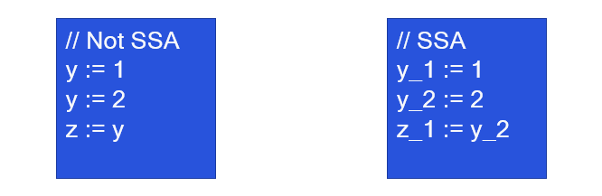

# LLVM Passes for Security: A Brief Introduction (Part 1/4)

## Abstract 

This is the first of the four modules that aim to write LLVM passes for security purposes. LLVM is a powerful project that includes several modules adopted in the context of compilers. Now, the goal of this series spins around the world of system security and thus, even though compilers' concepts are extremely interesting (at least for me) and useful to understand program analysis, we'll only review some essential takeaways that we need for our purpose. My personal point of view here is that when I was learning LLVM, I didn't find a good introductory resource on this topic other than reading the source code of some popular applications (ASAN, fuzzers, ..). I agree that this is a good exercise, but maybe as a beginner, I would have saved some time if I had found a more structured material. That's it.

So, this first chapter deals with the LLVM architecture and its IR (Intermediate Representation), but don't expect to go too much in depth because I'll just provide you with some basic ideas you need to understand to properly understand the following parts. If you're looking for nested and deep LLVM details I suggest you to reading papers, official docs, ...

Then, in the following three modules, we'll go to apply these concepts in three typical use cases that show the use of LLVM for security related tasks. More specifically, we'll develop three LLVM passes, trying to understand step by step the core APIs of the framework as well as the concepts. Obviously, three passes cannot cover the entire set of LLVM security applications that one may deploy, but I strongly believe that this will help to build a base knowledge around this technology in the scope of security. Here you can find the structure of the course:

1. Introduction to LLVM, its IR and our Hello World pass
2. Our first Analysis Pass -- **Pointer Analysis**
3. A Transformation Pass -- **Address Sanitizer**
4. A Pass for Fuzzing -- **Coverage and Context Sensitivity**

### A Compiler Architecture in a Nutshell

Essentially, we can split a compiler in three main parts:

- The Front-end: this part carries on the initial processing of the source code by performing lexical analysis, syntax analysis and semantical analysis. The output of the frontend is a syntax tree, that in several cases is known as AST (Abstract Syntax Tree)

- The Middle-end: at this stage we take the syntax tree and we translate into a more compiler-friendly representation that we call IR (Intermediate Representation). Usually, an IR is a code representation that has some good properties that make it easier to implement optimizations to increase the execution speed of the final binary. Remember that the first design goal of a compiler is to push the performances as much as it can. Finally, note that usually, IRs are target architecture *INDEPENDANT*.

- The Back-end: this is the terminal part of a compiler that is in charge of generating the final machine code. Also for this stage, we have a set of optimization that now are architecture-dependant, for instance to select the better instructions or to decide which variables should stay in the registers (faster) and which ones in memory (slower)


### LLVM Passes

Now that we have a basic idea about the internals of a compiler, we can better understand where LLVM passes execute. In particular, LLVM passes work at the middle-end and process the IR. Typically a compiler runs a huge number of passes for optimization/analysis purposes and thus in LLVM we have a Pass Manager, that decides the order. Our pass will run at this stage, together with the other passes and it may use the result of some already executed passes. For instance, while writing a new pass, we can declare that we need the results of pass X and Y and the Pass Manager will take care of running our code after X and Y.

In LLVM, all passes inherit from `Pass`. Then, according to our needs, we can have: `ModulePass`, `CallGraphSCCPass`, `FunctionPass`, `LoopPass`, `RegionPass`, or `BasicBlockPass`. More material is available [here](https://www.llvm.org/docs/WritingAnLLVMPass.html#writing-an-llvm-pass-callgraphsccpass). The main idea is that each type of pass has a different granularity level and order of visits. For instance, a `FunctionPass` lets you visit each function separately and so it can be a good solution for intra-procedural analysis. the `CallGraphSCCPass` also works at the function granularity, but differently from the `LoopPass` is useful to visit the functions in a bottom-up way on the callgraph (callees before the callers).
This let us introduce the main types of elements that we can find in an LLVM pass: the Module, the Function, the Basic Block and the Instruction. In addition to this, note that we have the superclass `Value` that is super-type of Function, BasicBlock and Instruction, among the other things (but also for instance , `Value` is super-type of the Function arguments). This, as we will see, is a key-idea to split the entities present in the Control Flow Graph of the application we are analysing.

An orthogonal way to classify compiler passes is to split them into `Analysis` vs. `Transformation` passes, where the former indicates the fact that we don't modify the IR while in the second case yes. However, while the output type depends inherently on the type of pass, we can safely assume that a pass is a piece of code that takes as an input code in its Intermediate Representation. In LLVM the intermediate code is simply called LLVM IR.

### The LLVM IR

As I already said, the LLVM IR respects a set of properties that make it easier to analyse/optimize such type of code.
The first thing that we can say is that the set of IR instructions is known as `Virtual LLVM Instruction Set` because it lacks of some instructions that exist in machine-level IRs such as I/O and other operating system functions.
Instructions operate on operands that can be either LLVM-level variables (a.k.a. virtual registers), memory or constants. Moreover, LLVM IR is strongly typed but importantly language-independant even though the types overlap with the ones of C-based languages. 

One of the first properties that arithmetical/logical instructions use is the three address code, i.e., usually these types of instructions have the following form (here they're not typed for simplicity):

    %var_1 = div %var_2, %var_3
    %res   = and %var1, 0xffff

As you can see these involves three operands and it is a very well-known form also for other intermediate representations. 

Probably the most important property that it is used in LLVM IR is Static Single Assignment (SSA). Citing Lattner et al. "a program is said to be in SSA form if each of its variablesis defined exactly once, and each use of a variable is dominated by that variable’s definition". This is great for dependency based optimizations because only one definition can reach a particular use and usually retrieve that definition is trivial. See for instance the sketch in the following image. In the SSA case, it's trivial to understand what is the value of `z_1` because `y_2` only has one definition thanks to the SSA form. Differently, in the box on the left (Not SSA), inferring the value of `z` would require a reaching definition analysis.





Even though the LLVM Instruction Set is virtual, we have several types of instructions. We already introduced arithmetical/logical instructions. Other two instructions that we will adopt for sure are the memory operations to read/write the memory, namely `Load` and `Store`:

    %0 = load i32, i32* %x, align 4 --> It loads from memory %x an int 32 bit into %0
    store i32 123, i32* %x, align 4 --> It stores the constant 123 at %x. Note that the store instruction doesn't have a return value

There are other memory-related instructions that we won't cover here, for instance those ones that deal with the vector accesses. The last two memory operations that we introduce here are the `Alloca` instruction that can be considered as an equivalent of the malloc but to allocate memory on the stack and the `GetElementPtr`, that I explain later. Roughly, we can say the `Alloca` is usually adopted to allocate the local variables.

    %x = alloca i32, align 4        --> This allocates space on the stack for an int 32 bits

The `GetElementPtr` instruction instead is used to get addresses of elements contained in aggregared data structures, such as structs or arrays. It can take two or three values as an input, according to the type of access. For instance,
    
    %arrayidx = getelementptr i64, i64* %array, i64 4             --> arrayidx = array[4] , i.e., the first value represents the array base address and the second value represents the item (index) to access

    %structfield = getelementptr i64, i64* %struct, i64 2         --> structfield = struct->field_number_2 , i.e., the first value represents the struct base address and the second value represents the struct field to access

    %structfield = getelementptr i64, i64* %struct, i64 2, i64 4  --> structfield = struct->field_2[4] , i.e., the first value represents the base address, the second value represents the struct field to access and the third one the index


Then, `Call` and `Ret` are used respectively to call and return from a routine (with in case possibility to specify input/output parameters) while `Br` is the branch instruction that typically follows a comparison such as `Icmp` (Integer Comparison) or `Fcmp` (Floating point Comparison). Finally, due to the design of SSA form have the so called `Phi` nodes (or `Phi` instruction). Let's try to understand how this works by focusing on the following C code.

```c
    int max(int a, int b) {
      if (a > b) {
        return a;
      } else {
        return b;
      }
    }
```

When we compile with clang `-O0`, that is, the less aggressive level of code optimization, we get something similar to this:

```llvm
    define i32 @max(i32 %a, i32 %b) {
    entry:
      %retval = alloca i32, align 4
      %0 = icmp sgt i32 %a, %b
      br i1 %0, label %btrue, label %bfalse
    
    btrue:                                      ; preds = %2
      store i32 %a, i32* %retval, align 4
      br label %end
    
    bfalse:                                     ; preds = %2
      store i32 %b, i32* %retval, align 4
      br label %end
    
    end:                                     ; preds = %btrue, %bfalse
      %1 = load i32, i32* %retval, align 4
      ret i32 %1
    }
```

When the compiler optimizes this, one way is to avoid allocating too much memory with alloca, because in machine code this will result in more memory accesses rather than register accesses, and thus it tries to promote memory variables into registers (mem2reg pass in LLVM). One way to do this is to assign `retval` twice, as in the following snippet. However, this is implossible in SSA, because each variable must be defined only once. 

```llvm
    define i32 @max(i32 %a, i32 %b) {
    entry:
      %0 = icmp sgt i32 %a, %b
      br i1 %0, label %btrue, label %bfalse
    
    btrue:
      %retval = %a
      br label %end
    
    bfalse:
      %retval = %b
      br label %end
    
    end:
      ret i32 %retval
    }
```

Since we cannot re-define twice `retval` we introduce the concept of `phi`. Roughly speaking you can see this instruction as the ternary operator in C. For instance in the following snippet, the `phi` node is such that it assigns `retval` only once and the value of `retval` is `a` if the block `btrue` is the predecessor while `b` if the block `bfalse` is the predecessor.


```llvm
    define i32 @max(i32 %a, i32 %b) {
    entry:
      %0 = icmp sgt i32 %a, %b
      br i1 %0, label %btrue, label %bfalse
    
    btrue:                                      ; preds = %2
      br label %end
    
    bfalse:                                     ; preds = %2
      br label %end
    
    end:                                     ; preds = %btrue, %bfalse
      %retval = phi i32 [%a, %btrue], [%b, %bfalse]
      ret i32 %retval
    }
```

Several other instructions exist, as well as identifiers, keywords, intrinsics, etc. that are part of LLVM. These are not covered in this short guide while you can find them [here](https://llvm.org/docs/LangRef.html). 

Finally, Note that sometimes you'll need to read a bit of LLVM IR code to understand/debug your pass. If you're compiling C code just issue the following code:

    clang input_file.c -S -emit-llvm -o input_file.ll

The output file `input_file.ll` will contain textual representation of the generated IR.

### The Hello World in LLVM

Let's quickly see a few steps that are needed to write and execute our passes at compile time. Let's refer to the code present in `src/HelloWorldPass`. For all the following implementations I will refer to `llvm-12` (and consequently `clang-12`). Typically APIs may change from a version to another, but once you'll learn the concepts moving from one version to another will be just a matter of changing a few lines.

First, there is some code that we need to register our pass and let the Pass Manager know that at some point he will have to run it. Much of this code is just to copy-and-paste, except for the pass name and a few other minor things:

```c

char Hello::ID = 0;
static RegisterPass<Hello> X("hello", "Hello World Pass",
                             false /* Only looks at CFG */,
                             false /* Analysis Pass */);

static RegisterStandardPasses Y(
    PassManagerBuilder::EP_EarlyAsPossible,
    [](const PassManagerBuilder &Builder,
       legacy::PassManagerBase &PM) { PM.add(new Hello()); });
```

Then, you just need to derive the type of pass in your class/struct. For instance, in this case we're gonna derive from `ModulePass`. Our struct `Hello` will inherit the methods of `ModulePass`. Among the others, the most important one is the `runOnModule(Module &M)` that we definitely want to override to add our own code. In this snippet of code, we just print "Hello world" for each module that we compile:

```c
struct Hello : public ModulePass {
  static char ID;
  Hello() : ModulePass(ID) {}

  bool runOnModule(Module &M) override {
    errs() << "Hello world\n";

    return false;
  }
};
```

To compile our pass, we just need to generate a shared library (.so) out of our source file that clang will load at compile time. Thus, we can issue something like the following command:
    /usr/lib/llvm-12/bin/clang++ -std=c++17 `llvm-config --cxxflags --ldflags` -Wl,-znodelete -fno-rtti -fpic -Wall -Wno-variadic-macros -shared -fPIC Hello.cpp -o Hello.so

To make the things more automated, I created a Makefile for each of the project that you have in this course. It essentially retrieves the correct clang, version, libraries, flags and run the previous command.
Finally, for the sake of automation, you'll find a python compiler wrapper that essentially invokes the following command:

    clang-12 ../../examples/base/src.c -Xclang -load -Xclang src/HelloWorldPass/./Hello.so

That is, it invokes clang and it loads our pass (`Hello.so`) so that it runs at compile time. In some cases this becames pretty useful, especially if the command line is more complicated, if you have linker flags and other options. 
